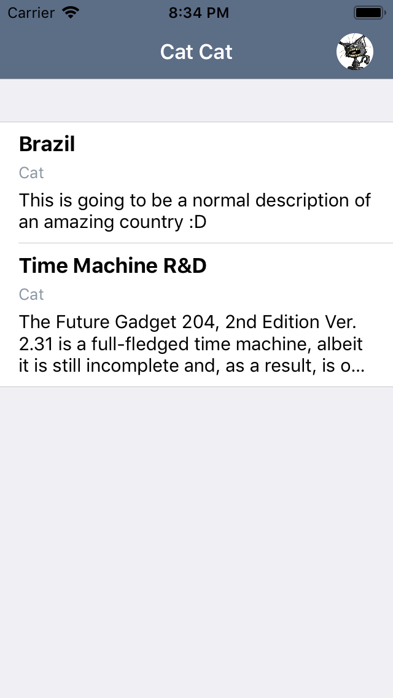
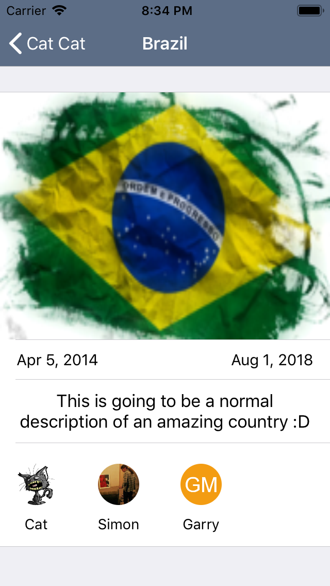

# App

Simple app to show a list of a user´s projects. Powered by the Teamwork API

### Overall Architecture

The presentation layer is based on MVP. The communication from the presenter to the view (viewcontroller) is through a protocol. There should not be logic in the view, just framework related code. Moving the logic to the presenter increases the testability.

The data layer uses a repository pattern. Since there is only one datasource at the moment, the access to the data is directly trough the datasource. If we add a new datasource in the future, the repository itself should be created to handle the data access policies.

### Dependencies

The dependencies management is done using CocoaPods
  - Alamofire. For the API Client
  - SDWebImage. To download remote images 
  - SwiftLint. To ensure the community conventions are followed
  - OHHTTPStubs. For the integration tests
 
### Testing strategy

There are two important components I wanted to test: the presenters and the API datasources

To test the API datasources (integration tests) I made use of OHHTTPStubs to mock certain HTTP responses. With this, the actual endpoint is never reached but a local file, making the tests fast and easy to validate

To test the presenters I made use of two kind of test doubples: a mock, and a spy. The mock purpose is to let the presenter believe it is getting an actual response, and then, the spy, to verify if the interaction with the "view" is the expected one.

### Technical details

The parsing of the models is done using the Codable protocol

Both the projects list, and the project detail, make use of a table view with variable height rows

### References

* [Test double](https://martinfowler.com/bliki/TestDouble.html)
* [Object mother](https://martinfowler.com/bliki/ObjectMother.html)
* [Repository pattern](https://docs.microsoft.com/en-us/dotnet/standard/microservices-architecture/microservice-ddd-cqrs-patterns/infrastructure-persistence-layer-design)
* [MVP](https://en.wikipedia.org/wiki/Model%E2%80%93view%E2%80%93presenter)
